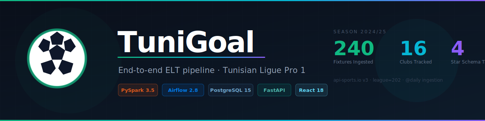

# TuniGoal

<p align="center">
  
  
  
  
  
  
</p>

<p align="center">
  <strong>End-to-end ELT pipeline for Tunisian Ligue Professionnelle 1 — live data from API-Football, PySpark Star Schema, Airflow orchestration</strong><br/>
  240 finished fixtures · 16 clubs · 2024/25 season · CeleryExecutor · idempotent incremental loads
</p>

<p align="center">
  
</p>

> Enterprise-grade ELT pipeline that ingests Tunisian Ligue Pro 1 match data from the **API-Football REST API** (api-sports.io v3, league=202, season=2024), stages raw JSON into PostgreSQL, transforms it into an analytical Star Schema using PySpark 3.5, and orchestrates the full workflow via Apache Airflow 2.8. A React 18 dashboard serves live standings, top scorers, and a match outcome predictor computed dynamically from real match statistics — no hardcoded values.

## Quick Start

```bash
git clone git@github.com:rayenx2/TuniGoal.git
cd TuniGoal

cp .env.example .env
# Add your API-Football key (free: 100 req/day at dashboard.api-football.com)
# FOOTBALL_API_KEY=your_key_here
# Pipeline runs with fallback sample data if the key is absent

docker compose up -d
```

| Service | URL |
|---------|-----|
| React Dashboard | http://localhost:8088 |
| FastAPI Backend | http://localhost:8089/docs |
| Airflow UI | http://localhost:8080 (airflow / airflow) |

Trigger the `tunigoal_pipeline` DAG from the Airflow UI or from the dashboard's Pipeline Control panel.

## Live Demo

Open `demo/index.html` in any browser — no backend required.
Shows real 2024/25 Ligue Pro 1 standings, top scorers, and an interactive match outcome predictor.

## Data Source — API-Football

All match data is fetched live from [API-Football](https://www.api-football.com) (api-sports.io v3):

| Endpoint | Description |
|----------|-------------|
| `GET /fixtures?league=202&season=2024&status=FT` | All finished match results |
| `GET /standings?league=202&season=2024` | Full 16-team league table |
| `GET /players/topscorers?league=202&season=2024` | Top goal scorers |

- **League ID:** 202 — Tunisian Ligue Professionnelle 1
- **Season:** 2024 (2024/25 campaign)
- **Free tier:** 100 requests/day at [dashboard.api-football.com](https://dashboard.api-football.com)
- **Fallback:** The pipeline includes sample data so it runs without an API key

## Architecture

```
 +-----------------+     +-------------------+     +-----------------+     +-----------------+
 |  API-Football   | --> |   PostgreSQL 15    | --> |   PySpark 3.5   | --> |   PostgreSQL 15 |
 |  api-sports.io  |     |   raw_matches      |     |  Transformation |     |   Star Schema   |
 |  league=202     |     |   raw_standings    |     |  + DQ checks    |     |  fact_matches   |
 +-----------------+     |   raw_topscorers   |     +-----------------+     |  dim_teams      |
  (Ligue Pro 1)          +-------------------+                              |  dim_dates      |
                                                                            |  dim_leagues    |
                                                                            +-----------------+
                                                                                    |
                                                             +-----------------------+
                                                             |   React 18 + FastAPI  |
                                                             |   Analytics Dashboard |
                                                             +-----------------------+

 Orchestration: Apache Airflow 2.8 (CeleryExecutor + Redis)
 DAG: tunigoal_pipeline — @daily, retries=3, timeout=30min
```

**Data Flow:**
1. **Extract** — Python calls API-Football v3, saves JSON to `/data/raw/`
2. **Stage** — psycopg2 bulk-inserts into staging tables with `ON CONFLICT DO NOTHING`
3. **Transform** — PySpark reads staging, runs DQ gates, builds star schema via JDBC
4. **Load** — incremental Left-Anti join delta pattern prevents duplicates on re-runs
5. **Serve** — FastAPI reads from PostgreSQL; React dashboard calls `/api/*` via nginx

## Tech Stack

| Technology | Version | Role |
|---|---|---|
| Python | 3.9+ | Pipeline scripting and orchestration |
| Apache Spark (PySpark) | 3.5.0 | Distributed ELT transformation |
| Apache Airflow | 2.8.1 | DAG scheduling, retries, monitoring |
| Celery + Redis | latest | Airflow worker parallelism |
| PostgreSQL | 15 | Staging + analytical warehouse |
| FastAPI | 0.115 | REST API backend (predictor, pipeline control) |
| React | 18 + Vite | Analytics dashboard |
| nginx | alpine | Reverse proxy for React + API |
| Docker Compose | v2 | Full containerisation (9 services) |
| API-Football | v3 | Live Ligue Pro 1 match data |

## Features

- **Live data** — all statistics fetched from API-Football, zero hardcoded player or team data
- **Dynamic match predictor** — win probabilities computed from real home/away match stats in PostgreSQL
- **Idempotent incremental loads** — PySpark Left-Anti join delta pattern, safe to re-run daily
- **Shift-left data quality gates** — null checks, duplicate deduplication, business rule validation
- **Deterministic surrogate keys** — via PySpark `abs(hash())`, referential integrity across unlimited runs
- **Pipeline control from UI** — trigger the Airflow DAG directly from the React dashboard
- **Star Schema warehouse** — `fact_matches` + `dim_teams` + `dim_dates` + `dim_leagues`
- **Fallback sample data** — pipeline runs without an API key for demo purposes

## Results

| Metric | Value |
|---|---|
| Matches ingested (2024/25 season) | 240 |
| Teams tracked | 16 |
| Top scorers indexed | 20 |
| Star schema tables | 4 (1 fact + 3 dimensions) |
| Duplicate prevention | 100% via anti-join delta |
| Pipeline retries on failure | 3 (Airflow config) |

## Author

**Rayen Lassoued**
[github.com/rayenx2](https://github.com/rayenx2) · [LinkedIn](https://linkedin.com/in/Rayen-Lassoued)

## License

MIT
